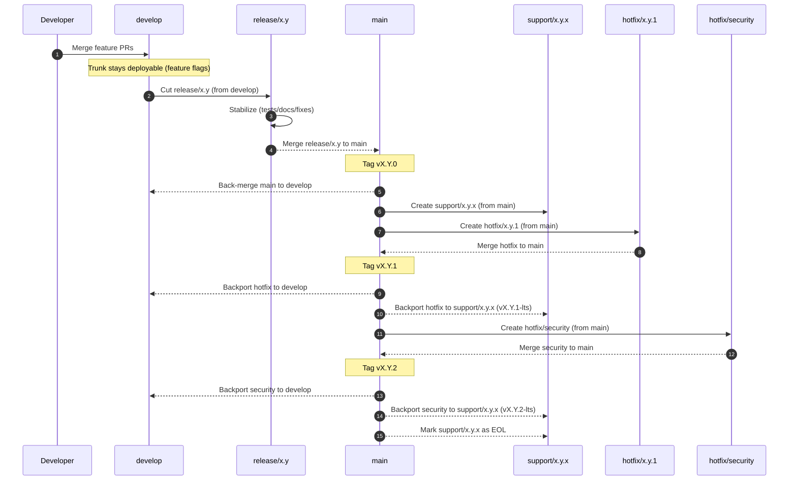

I'm working on a more complex version of git flow.

```mermaid
sequenceDiagram
    autonumber

    %% Participants (branches/roles)
    participant Dev as Developer
    participant D as develop
    participant R as release/x.y
    participant M as main
    participant S as support/x.y.x
    participant HF as hotfix/x.y.1
    participant Sec as hotfix/security

    %% Feature work -> develop
    Dev->>D: Merge feature PRs
    Note over D: Trunk stays deployable (feature flags)

    %% Cut release -> stabilize -> ship
    D->>R: Cut release/x.y (from develop)
    R->>R: Stabilize (tests/docs/fixes)
    R-->>M: Merge release/x.y to main
    Note over M: Tag vX.Y.0

    %% Back-merge + open LTS
    M-->>D: Back-merge main to develop
    M->>S: Create support/x.y.x (from main)

    %% Hotfix to main + backports
    M->>HF: Create hotfix/x.y.1 (from main)
    HF-->>M: Merge hotfix to main
    Note over M: Tag vX.Y.1
    M-->>D: Backport hotfix to develop
    M-->>S: Backport hotfix to support/x.y.x (vX.Y.1-lts)

    %% Security hotfix across supported lines
    M->>Sec: Create hotfix/security (from main)
    Sec-->>M: Merge security to main
    Note over M: Tag vX.Y.2
    M-->>D: Backport security to develop
    M-->>S: Backport security to support/x.y.x (vX.Y.2-lts)

    %% Optional EOL
    M-->>S: Mark support/x.y.x as EOL
```

jk. ssh onto the server and edit files there.
